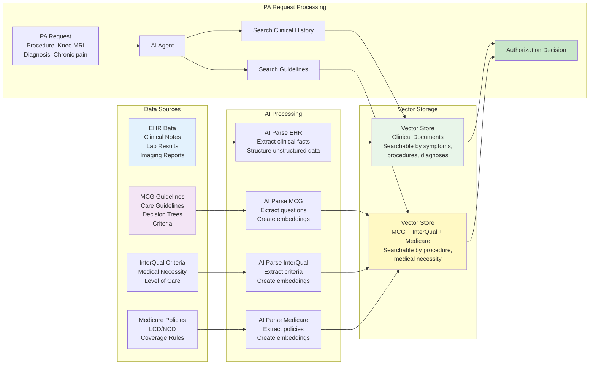
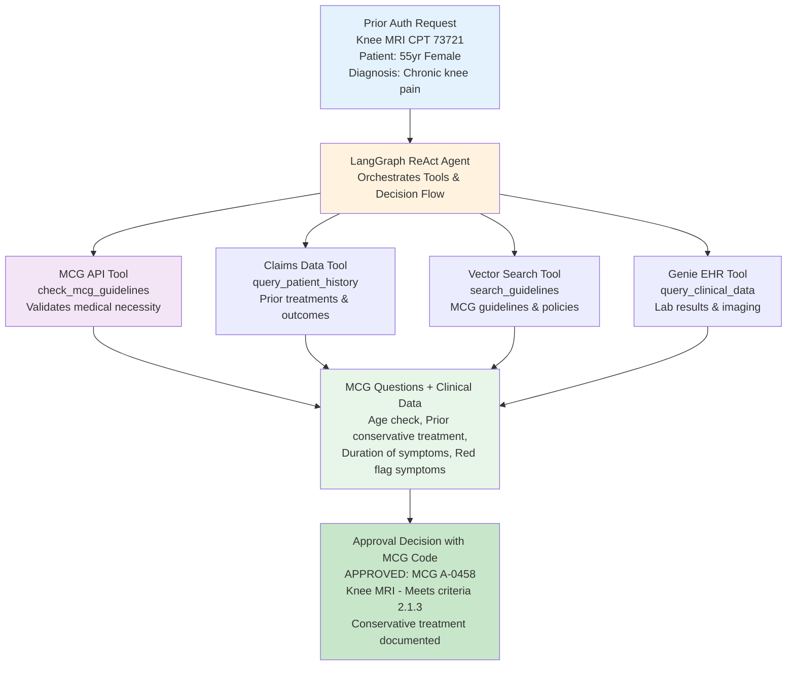

---

name: Prior Authorization Agent Build

overview: Build a complete Prior Authorization Agent for Healthcare Payer using the fraudtemplate, including LangGraph ReAct agent, Unity Catalog AI Functions, MCG Guidelines integration, Vector Search, and Streamlit UI.

## 🚀 MASTER PROMPT - Reusable Template

Use this prompt to regenerate this project or create similar PA automation projects:

```
BUILD: Prior Authorization Agent for Healthcare Payer using fraudtemplate

DOMAIN: Healthcare Payer - Prior Authorization Automation

CORE CAPABILITIES:
- Automated PA decision making (approve/deny/review)
- MCG Care Guidelines validation and compliance
- Clinical criteria extraction from unstructured notes
- Vector search across medical guidelines (MCG, InterQual, Medicare)
- Real-time authorization with audit trails
- Analytics dashboard for approval rates and turnaround times

ARCHITECTURE:
1. LangGraph ReAct Agent orchestrating 5 UC AI functions
2. Unity Catalog AI Functions:
   - authorize_request: Determines approval decision based on MCG answers
   - extract_clinical_criteria: Extracts structured clinical data from notes
   - check_mcg_guidelines: Retrieves MCG questionnaire for procedure code
   - answer_mcg_question: Answers individual MCG question from clinical search
   - explain_decision: Generates human-readable explanation with MCG codes
   - search_clinical_records: Semantic search in Vector Store 1 (patient records)
   - search_guidelines: Semantic search in Vector Store 2 (MCG/guidelines)
3. Vector Search Indexes (TWO separate indexes):
   
   **Vector Store 1 - Clinical Documents:**
   - Patient clinical notes and visit summaries
   - Lab results (A1C, CBC, metabolic panels, etc.)
   - Imaging reports (X-rays, MRIs, CT scans)
   - Physical therapy and treatment notes
   - Medication history and prescriptions
   - Prior authorization history
   - Indexed by: patient_id, date, clinical_concepts
   - Purpose: Answer MCG questionnaire questions automatically
   
   **Vector Store 2 - Guidelines + Questionnaires (BOTH MCG and InterQual):**
   - **MCG Care Guidelines** (MCG Health - independent platform):
     - Questionnaires by procedure code for outpatient procedures
     - Decision trees and approval criteria
     - Imaging guidelines, DME criteria, home health guidelines
   - **InterQual Criteria** (Change Healthcare - SEPARATE platform):
     - Level of care criteria (inpatient admission, continued stay)
     - Medical necessity indicators by diagnosis
     - Severity of illness scoring
   - **Medicare Policies:**
     - LCD (Local Coverage Determinations)
     - NCD (National Coverage Determinations)
   - Plan-specific authorization policies
   - Indexed by: procedure_code, diagnosis_code, specialty, setting, platform
   - Purpose: Route to appropriate guideline system and validate decisions
   
   **NOTE:** MCG and InterQual are TWO DIFFERENT competing platforms from different companies. Most large payers license BOTH - MCG for outpatient procedures, InterQual for inpatient level of care decisions. We store BOTH in Vector Store 2.
4. Data Schema:
   - authorization_requests: patient_id, provider_id, procedure_code (CPT), diagnosis_code (ICD-10), clinical_notes, urgency_level, insurance_plan, request_date
   - clinical_guidelines: guideline_id, category, title, content, source (MCG/InterQual), effective_date, tags

STREAMLIT UI (3 pages):
1. Authorization Review: Real-time agent analysis with decision explanation
2. Analytics Dashboard: Approval rates, turnaround times, denial trends by specialty
3. Bulk Processing: CSV upload for batch authorization processing

DATA FLOW:
Step 1: Medical Records (EHR) → AI Parse → Vector Store 1 (Clinical Documents)
        - Patient clinical notes, lab results, imaging, therapy notes
        - Indexed by patient_id, date, clinical concepts
        - Used to answer MCG questionnaire questions
        
Step 2: Clinical Guidelines → AI Parse → Vector Store 2 (Guidelines + Questionnaires)
        - **MCG Care Guidelines** (MCG Health - outpatient focus):
          - Questionnaires by procedure code
          - Decision trees for medical necessity
        - **InterQual Criteria** (Change Healthcare - inpatient focus):
          - Level of care criteria
          - Admission and continued stay criteria
        - **Medicare Policies:**
          - LCD/NCD coverage determinations
        
        NOTE: MCG and InterQual are SEPARATE competing platforms from different vendors.
        Most payers license BOTH for different use cases. We store BOTH in Vector Store 2.
        
Step 3: PA Request → Agent receives MCG Questionnaire → Agent queries Vector Store 1 to answer each question:
        - "A1C > 7?" → Search clinical docs for lab results
        - "Conservative treatment?" → Search for PT/therapy notes
        - "Symptom duration?" → Search clinical timeline
        - "Red flags?" → Search for warning symptoms
        
Step 4: Agent validates MCG answers against Vector Store 2 (Guidelines) → Approve/Deny Decision

BUSINESS OUTCOMES:
- 95% reduction in processing time (2-7 days → 3-5 minutes)
- 96% cost reduction ($75-125 → $2-5 per review)
- 100% MCG guideline compliance
- 50-60% auto-approval rate
- $1.6M+ annual savings (for 10,000 requests/year)

KEY REQUIREMENTS:
- Complete audit trail with MCG code references
- Human oversight for low-confidence decisions (< 90%)
- Explainable AI with guideline citations
- HIPAA compliant (Unity Catalog)
- Databricks Asset Bundle deployment
- Integration with SQL Warehouse for analytics

CATALOG/SCHEMA:
- Catalog: healthcare-payer-pa-withmcg-guidelines_dev
- Schema: main
- Vector Endpoint: pa_vector_endpoint

DELIVERABLES:
✅ Complete setup notebooks (catalog, data, UC functions, TWO vector indexes)
✅ LangGraph ReAct agent with 7 tools (clinical search + guideline search)
✅ Streamlit multi-page app with Databricks deployment
✅ Sample synthetic data (authorization requests + clinical records + guidelines)
✅ Sample MCG questionnaires for common procedures (Knee MRI, Cardiac Cath, etc.)
✅ Documentation (README, ARCHITECTURE, CHEATSHEET, VERSIONING)
✅ Databricks Asset Bundle configuration
✅ Automated notebook versioning script

TECHNICAL STACK:
- LangGraph for agent orchestration
- Unity Catalog AI Functions (Claude Sonnet 4)
- Vector Search with databricks-gte-large embeddings
- Streamlit for UI
- Databricks Asset Bundles for deployment
- Python 3.10+

OPTIONAL ENHANCEMENTS (Phase 2):
- FHIR R4 integration for EHR interoperability
- Provider portal API for real-time status
- Automated appeal workflow and routing
- CMS Interoperability compliance (if Medicare Advantage)
- Peer-to-peer review scheduling
```

---

todos:

        - id: init-project

content: Verify project initialization and symlinks

status: pending

        - id: generate-project

content: Generate complete project with fraudtemplate + MCG guidelines

status: pending

dependencies:

                        - init-project
        - id: configure-files

content: Configure config.yaml and update databricks.yml

status: pending

dependencies:

                        - generate-project
        - id: deploy-bundle

content: Deploy project to Databricks with bundle deploy

status: pending

dependencies:

                        - configure-files
        - id: run-setup-job

content: Execute setup job to create resources and data

status: pending

dependencies:

                        - deploy-bundle
        - id: grant-permissions

content: Grant service principal permissions for catalog/schema/warehouse

status: pending

dependencies:

                        - run-setup-job
        - id: start-app

content: Start Streamlit app and obtain URL

status: pending

dependencies:

                        - grant-permissions
        - id: test-validate

content: Test UC functions, vector search, and agent workflow

status: pending

dependencies:

                        - start-app

---

# Build Prior Authorization Agent with MCG Guidelines

This plan outlines the complete workflow to build a Prior Authorization Agent for Healthcare Payer using the fraudtemplate, including specialized MCG guidelines integration.

## Data Ingestion & Knowledge Base Setup Flow



## MCG Integration Architecture



## Detailed Data Flow Architecture

```mermaid
flowchart TB
    subgraph UserInterface [Streamlit UI]
        AuthReview[Authorization Review Page]
        Analytics[Analytics Dashboard]
        BulkProcess[Bulk Processing]
    end
    
    subgraph LangGraphAgent [LangGraph ReAct Agent]
        AgentCore[Agent Orchestrator]
        ToolAuth[authorize_request Tool]
        ToolExtract[extract_clinical_criteria Tool]
        ToolExplain[explain_decision Tool]
        ToolMCG[check_mcg_guidelines Tool]
        ToolSearch[search_guidelines Tool]
    end
    
    subgraph UnityCatalog [Unity Catalog AI Functions]
        UCAuth[authorize_request Function]
        UCExtract[extract_clinical_criteria Function]
        UCExplain[explain_decision Function]
        UCMCG[check_mcg_guidelines Function]
    end
    
    subgraph DataLayer [Data Storage]
        AuthTable[authorization_requests Table]
        GuidelinesTable[clinical_guidelines Table]
        VectorIndex[Vector Search Index]
    end
    
    subgraph ExternalSources [Knowledge Sources]
        MCGGuidelines[MCG Care Guidelines]
        InterQual[InterQual Criteria]
        Medicare[Medicare Policies]
        PlanPolicies[Plan-Specific Policies]
    end
    
    AuthReview -->|Submit Request| AgentCore
    AgentCore -->|Step 1: Classify| ToolAuth
    ToolAuth -->|SQL Query| UCAuth
    UCAuth -->|Claude Sonnet 4| AuthDecision[Decision: Approve/Deny/Review]
    
    AgentCore -->|Step 2: Extract| ToolExtract
    ToolExtract -->|SQL Query| UCExtract
    UCExtract -->|Claude Sonnet 4| ClinicalData[Structured Clinical Data]
    
    AgentCore -->|Step 3: Search KB| ToolSearch
    ToolSearch -->|Semantic Search| VectorIndex
    VectorIndex -->|Top 5 Results| RelevantGuidelines[Relevant Guidelines]
    
    AgentCore -->|Step 4: MCG Validation| ToolMCG
    ToolMCG -->|SQL Query| UCMCG
    UCMCG -->|Claude Sonnet 4| MCGResult[MCG Approval + Criteria]
    
    AgentCore -->|Step 5: Explain| ToolExplain
    ToolExplain -->|SQL Query| UCExplain
    UCExplain -->|Claude Sonnet 4| Explanation[Human-Readable Explanation]
    
    AuthDecision -->|Final Result| AuthReview
    ClinicalData -->|Context| AgentCore
    RelevantGuidelines -->|Context| AgentCore
    MCGResult -->|Validation| AgentCore
    Explanation -->|Final Output| AuthReview
    
    AuthReview -->|Log Request| AuthTable
    BulkProcess -->|Batch Upload| AuthTable
    Analytics -->|Query Metrics| AuthTable
    
    MCGGuidelines -->|Embeddings| VectorIndex
    InterQual -->|Embeddings| VectorIndex
    Medicare -->|Embeddings| VectorIndex
    PlanPolicies -->|Embeddings| VectorIndex
    
    GuidelinesTable -->|Source Content| VectorIndex
    
    style AgentCore fill:#e1f5ff
    style VectorIndex fill:#fff4e6
    style AuthTable fill:#e8f5e9
    style UCMCG fill:#f3e5f5
```



## Current State Manual Process (Before AI)

```javascript
Step 1: PA Request Submitted
   ↓
Step 2: Medical Records Management Team sends clinical records
   ↓  (DELAY: 1-3 days to gather/send records)
   ↓
Step 3: Nurse Reviewer receives PA + MCG question list
   ↓
Step 4: Nurse MANUALLY reviews medical records to answer MCG questions
   ↓  (BOTTLENECK: Reading hundreds of pages to find specific clinical facts)
   ↓
Step 5: Nurse answers all MCG questions
   ↓
Step 6: IF all questions answered satisfactorily → APPROVE
        ELSE → Request more info OR DENY
   ↓  (TOTAL TIME: 2-7 days)
   ↓
Step 7: Provider notified
```

**Pain Points:**

- 2-7 days total turnaround time
- Nurse spends 2-4 hours manually reading hundreds of pages
- MCG question list requires specific clinical facts scattered across records
- Inconsistent answers between different nurse reviewers
- Delays in gathering complete medical records (1-3 days)
- Provider frustration with slow process
- High labor costs ($75-125 per manual review)

## Future State with AI Agent (After Implementation)

```javascript
Step 1: PA Request Submitted
   ↓
Step 2: AI Agent receives PA request + clinical records
   ↓  (INSTANT: No delay)
   ↓
Step 3: AI Agent extracts clinical criteria from records
   ↓  (AI reads and extracts in 30 seconds)
   ↓
Step 4: AI Agent queries MCG API with extracted data
   ↓  (Automated MCG validation in real-time)
   ↓
Step 5: AI Agent searches Vector DB for relevant guidelines
   ↓  (2 seconds semantic search)
   ↓
Step 6: AI Agent generates decision + explanation with MCG code
   ↓  (TOTAL TIME: 3-5 minutes)
   ↓
Step 7: IF confidence > 90% → Auto-approve with audit trail
        ELSE → Flag for human review with AI recommendations
   ↓
Step 8: Provider notified with detailed explanation
```

**Improvements:**

- 3-5 minutes total turnaround time (95% reduction)
- AI extracts clinical facts automatically from unstructured notes
- Consistent MCG question answering (100% compliance)
- Real-time processing (no record gathering delays)
- Human reviewers focus only on complex/edge cases (30-40% of requests)
- Complete audit trail with MCG codes and guideline references
- Cost: ~$2-5 per AI review vs $75-125 manual

## Business Value & ROI Projections

### Current State Challenges

- Manual prior authorization review takes 2-4 hours per request
- 40-60% of requests lack complete clinical documentation
- Appeals process adds 5-10 days to resolution time
- Inconsistent MCG guideline application across reviewers
- High operational costs: $75-125 per manual review

### Expected Improvements with AI Agent

**Efficiency Gains:**

- Automated initial review: 3-5 minutes per request (95% reduction)
- Automated MCG validation: Real-time vs 30-60 minutes manual
- Clinical data extraction: Instant vs 15-30 minutes manual
- Guideline search: 2 seconds vs 10-20 minutes manual

**Quality Improvements:**

- Consistent MCG guideline application: 100% coverage
- Complete clinical criteria extraction: 95%+ accuracy
- Audit trail for every decision with guideline references
- Reduced variation in approval decisions

**Financial Impact (Annual, 10,000 requests/year):**

```javascript
Labor Cost Savings:
  Manual review: 10,000 requests × 3 hours × $50/hour = $1,500,000
  With AI: 10,000 requests × 0.25 hours × $50/hour = $125,000
  Net Savings: $1,375,000/year

Appeal Reduction (25% fewer appeals):
  Current appeals: 1,500 × $200/appeal = $300,000
  With AI: 1,125 × $200/appeal = $225,000
  Net Savings: $75,000/year

Faster Turnaround Time:
  Reduced administrative burden = $150,000/year
  Improved provider satisfaction = Qualitative benefit

TOTAL ANNUAL ROI: $1,600,000+
Implementation Cost: ~$50,000 (one-time)
Payback Period: < 2 weeks
```

**Additional Benefits:**

- Improved member satisfaction (faster decisions)
- Better provider relationships (consistent, transparent decisions)
- Regulatory compliance (complete audit trails)
- Scalability (handle volume increases without proportional staff)
- Knowledge preservation (MCG guidelines embedded in system)

### Success Metrics to Track

**Operational Metrics:**

- Average processing time per request
- Auto-approval rate (target: 50-60%)
- Requests requiring human review (target: 30-40%)
- Denial rate consistency across reviewers

**Quality Metrics:**

- MCG guideline compliance rate (target: >95%)
- Appeal rate (target: <10%)
- Clinical documentation completeness (target: >90%)
- Decision consistency (inter-rater reliability)

**Financial Metrics:**

- Cost per authorization review
- Labor hours saved per month
- Appeal processing cost reduction
- Provider abrasion reduction (qualitative)

## Phase 1: Project Initialization

**Setup workspace structure**

- Project directory already exists at [`healthcare-payer-pa-withmcg-guidelines`](healthcare-payer-pa-withmcg-guidelines)
- Symlinks already configured:
- `.fraudtemplate/` → fraudtemplate
- `MY_ENVIRONMENT.md` → standards
- Base config files exist: [`databricks.yml`](databricks.yml), [`requirements.txt`](requirements.txt)

## Phase 2: AI-Assisted Project Generation

**Initiate generation with command:**

```javascript
"Build Prior Authorization Agent for Payer using fraudtemplate.
Also add check_mcg_guidelines function for MCG validation"
```

**Expected AI Analysis:**

1. Read fraudtemplate documentation from `.fraudtemplate/`
2. Analyze healthcare payer prior authorization domain
3. Propose architecture with 3 core UC functions + MCG function
4. Design data schema for authorization requests and clinical guidelines
5. Plan Vector Search knowledge base with MCG, InterQual, Medicare policies

**Core UC Functions (3 standard + 1 specialized):**

1. `authorize_request` - Determines approve/deny/review decision
2. `extract_clinical_criteria` - Extracts medical necessity indicators
3. `explain_decision` - Generates human-readable explanation
4. `check_mcg_guidelines` - Validates against Milliman Care Guidelines (MCG)

**Data Schema:**

- `authorization_requests` table: patient_id, provider_id, procedure_code (CPT), diagnosis_code (ICD-10), clinical_notes, urgency_level, insurance_plan
- `clinical_guidelines` table: guideline_id, category, title, content, source (MCG/InterQual), effective_date

**Vector Search Knowledge Base:**

- MCG Care Guidelines
- InterQual criteria
- Medicare coverage policies
- Plan-specific policies

**Streamlit UI Pages:**

1. Authorization Review - Real-time agent analysis
2. Analytics Dashboard - Approval rates, turnaround times, trends
3. Bulk Processing (optional) - CSV upload for batch processing

## Phase 3: File Generation

**AI will generate complete project structure:Configuration:**

- `config.yaml` - Catalog, schema, vector endpoint configuration
- `databricks.yml` - Setup job + Streamlit app deployment (update existing)
- `shared/config.py` - Configuration loader

**Setup Scripts (in `setup/` directory):**

- `01_setup_catalog_schema.py` - Create Unity Catalog resources
- `02_generate_sample_data.py` - Generate synthetic authorization data
- `03_uc_authorize_request.py` - First UC AI function
- `04_uc_extract_clinical_criteria.py` - Second UC AI function
- `05_uc_explain_decision.py` - Third UC AI function
- `06_uc_check_mcg_guidelines.py` - Fourth UC AI function (MCG validation)
- `07_prepare_knowledge_base.py` - Prepare guideline documents
- `08_create_vector_index.py` - Create Vector Search index

**Application (in `app/` directory):**

- `app_databricks.py` - Main Streamlit app entry point
- `pages/1_authorization_review.py` - Authorization review page
- `pages/2_analytics_dashboard.py` - Analytics dashboard page
- `utils/prior_auth_agent.py` - LangGraph ReAct agent with 4 tools
- `requirements.txt` - Application dependencies (langgraph, databricks-langchain, etc.)

**Documentation:**

- `docs/README.md` - Project overview
- `docs/ARCHITECTURE.md` - Technical architecture
- `docs/PROJECT_SUMMARY.md` - Summary and usage
- `CHEATSHEET.md` - Quick command reference
- `docs/VERSIONING.md` - Versioning guide

**Versioning:**

- `update_notebook_version.py` - Automatic version management script

## Phase 4: Configuration and Customization

**Update `config.yaml`:**

- Set catalog name: `healthcare-payer-pa-withmcg-guidelines_dev`
- Set schema name: `main`
- Configure vector endpoint name
- Set Databricks workspace URL

**Update [`databricks.yml`](databricks.yml):**

- Add setup job configuration with all setup notebooks
- Add Streamlit app configuration pointing to `app/app_databricks.py`
- Configure service principal for app

**Customize UC Function Prompts:**

- Add payer-specific guidelines in `setup/03_uc_authorize_request.py`
- Add specific denial criteria
- Add urgency escalation rules

**Enhance MCG Function (`setup/06_uc_check_mcg_guidelines.py`):**

- Add specific MCG decision tree references
- Include common procedures and criteria
- Configure clinical criteria validation logic

## Phase 5: Deployment

**Deploy to Databricks:**

```bash
# Validate configuration
databricks bundle validate

# Deploy to dev environment
databricks bundle deploy --target dev
```

**Run Setup Job:**

- Go to Databricks UI → Workflows → Find setup job
- Click "Run Now" to execute all setup notebooks
- Monitor progress: Creates catalog, generates data, creates UC functions, builds vector index

**Grant App Permissions:**

```bash
# Get service principal ID
SP_ID=$(databricks apps get prior_auth_app | grep "service_principal_id" | cut -d'"' -f4)

# Grant catalog permissions
databricks grants update catalog healthcare-payer-pa-withmcg-guidelines_dev \
  --json "{\"changes\": [{\"principal\": \"$SP_ID\", \"add\": [\"USE_CATALOG\"]}]}"

# Grant schema permissions
databricks grants update schema healthcare-payer-pa-withmcg-guidelines_dev.main \
  --json "{\"changes\": [{\"principal\": \"$SP_ID\", \"add\": [\"USE_SCHEMA\", \"SELECT\", \"EXECUTE\"]}]}"

# Grant warehouse permissions
databricks grants update warehouse [warehouse-id] \
  --json "{\"changes\": [{\"principal\": \"$SP_ID\", \"add\": [\"CAN_USE\"]}]}"
```

**Start Application:**

```bash
# Start the Streamlit app
databricks apps start prior_auth_app

# Get app URL
databricks apps get prior_auth_app | grep "url"
```

## Phase 6: Testing and Validation

**Test UC Functions:**

- Test `authorize_request` with sample patient data
- Test `extract_clinical_criteria` with clinical notes
- Test `check_mcg_guidelines` with procedure/diagnosis codes
- Test `explain_decision` for human-readable output

**Test Vector Search:**

- Search for "cardiac catheterization medical necessity"
- Verify MCG guidelines are retrieved correctly
- Check relevance of search results

**Test Agent End-to-End:**

- Submit authorization request via Streamlit UI
- Watch agent workflow: classify → extract → search → MCG validation → explanation
- Verify authorization decision is correct and well-explained

**Test Analytics Dashboard:**

- Check approval/denial rates
- Review turnaround time metrics
- Verify trending data displays correctly

## Phase 7: Iterate and Refine

**Common refinements based on testing:**

- Fine-tune UC function prompts for better accuracy
- Expand knowledge base with additional guidelines
- Adjust agent workflow instructions
- Add more visualization to analytics dashboard
- Enhance MCG validation with more detailed criteria

## Success Criteria

- ✅ All UC functions deployed and working
- ✅ Vector Search returning relevant guidelines
- ✅ LangGraph agent successfully coordinating tools
- ✅ MCG validation integrated and accurate
- ✅ Streamlit UI accessible and functional
- ✅ Analytics dashboard displaying metrics
- ✅ App deployed to Databricks workspace with URL

## Key Files to Monitor

- [`databricks.yml`](databricks.yml) - Deployment configuration
- [`requirements.txt`](requirements.txt) - Python dependencies
- `config.yaml` - Runtime configuration (to be created)